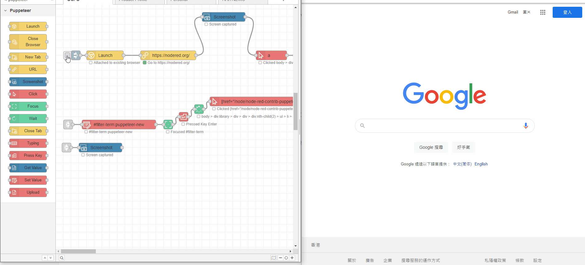

# node-red-puppeteer-core

## Warnings

Package upgrade would cause run flow error since more attribute and properties add to node. Please reserve time to test when upgrade component.

## Introduction

This package adds browser automation features using puppeteer-core to Node-RED. This package was inspired by [node-red-contrib-puppeteer](https://flows.nodered.org/node/node-red-contrib-puppeteer) and [node-red-contrib-puppeteer](https://flows.nodered.org/node/node-red-contrib-puppeteer) and [node-red-contrib-puppeteer](https://flows.nodered.org/node/node-red-contrib-puppeteer).

This package is build to work tightly with the browserless service. You can use the browserless service for free with a limited number of requests per month. You can also use your own browserless service or your own puppeteer-core installation.

[Check out Browserless](https://www.browserless.io/docs/puppeteer-library)

### Screenshots

Copy from [node-red-contrib-image-tools (node) - Node-RED (nodered.org)](https://flows.nodered.org/node/node-red-contrib-image-tools)

### Icons

by [fontawesome](https://fontawesome.com/license)

### Palettes

by [coolors.co](https://coolors.co/palette/ef476f-ffd166-06d6a0-118ab2-073b4c)
